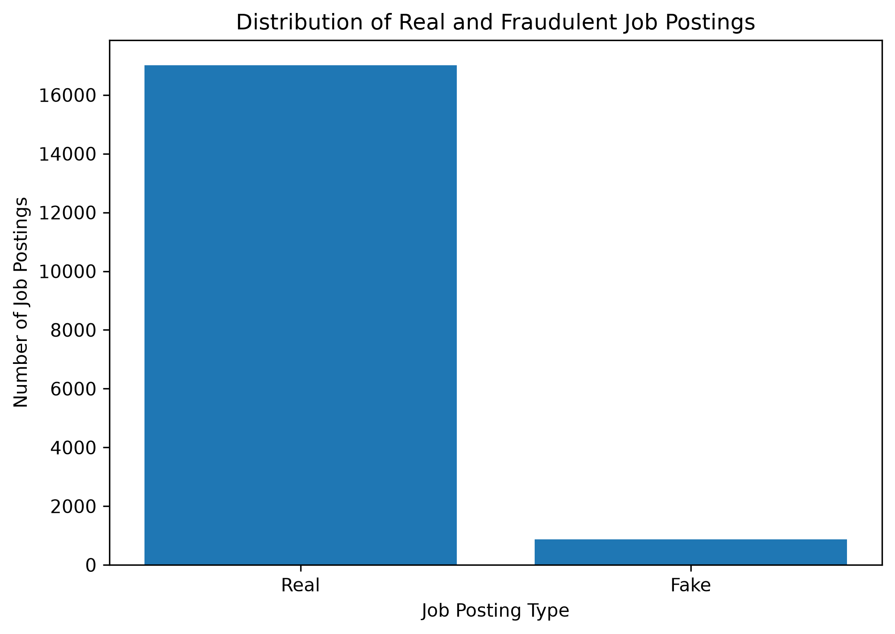
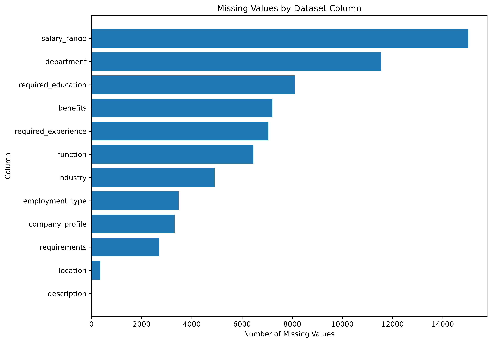
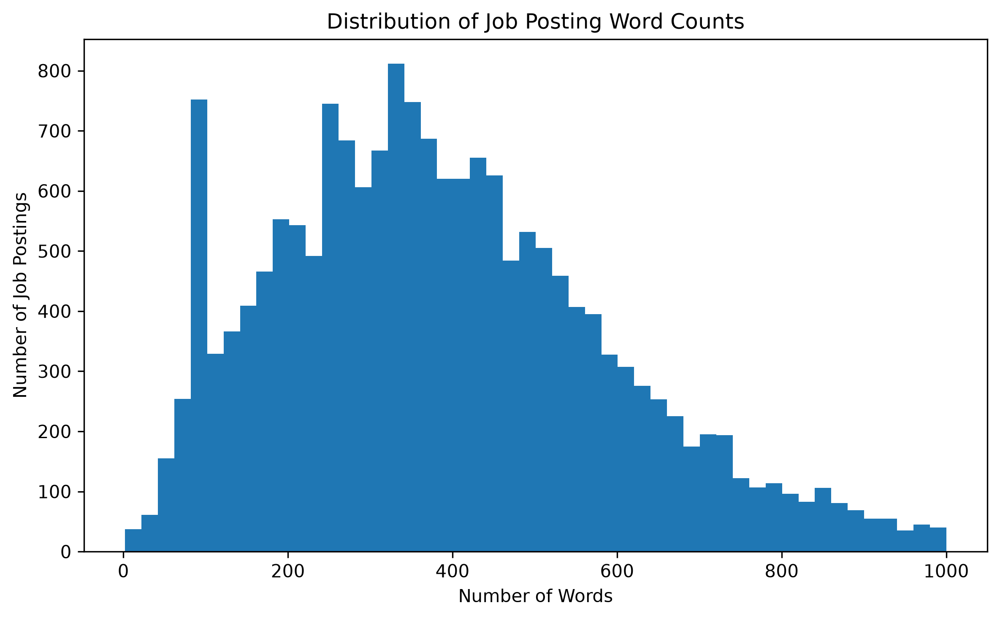
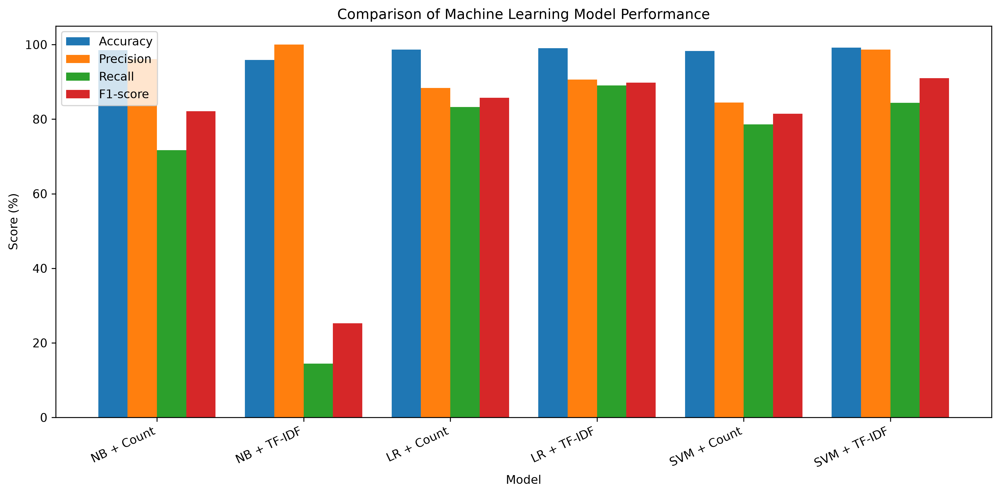
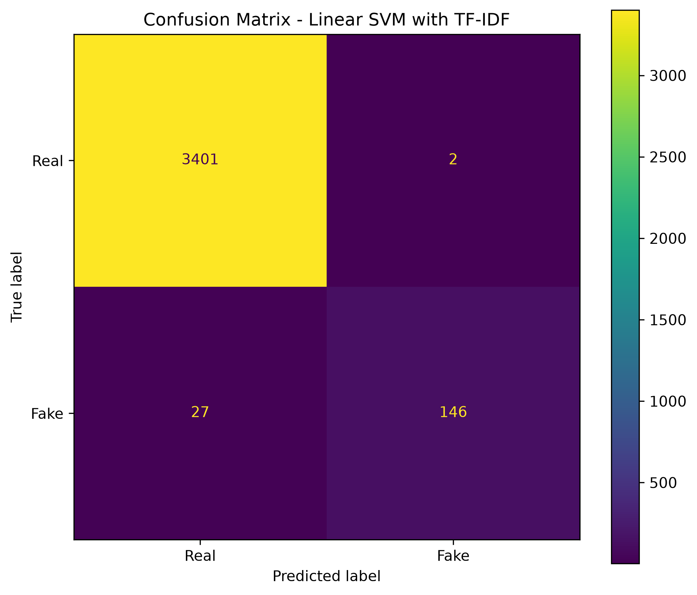
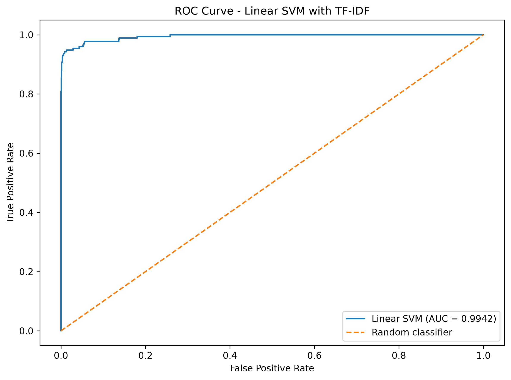

# Student Information

| Field | Information |
|---|---|
| Student Name | Divyansh Chawla |
| Student ID | GH1031116 |
| Module | AI Applications for Digital Business |
| Project Title | AI-Based Fake Job Posting Detection Using Natural Language Processing and Machine Learning |
| GitHub Repository | https://github.com/divyanshchawlaa/fake-job-posting-detection |

<div style="page-break-after: always;"></div>

# 1. Research Question and Problem Statement

Online recruitment platforms like LinkedIn, Indeed and Glassdoor have made it much easier for people to search and apply for jobs. As undergraduate students, we all will soon be looking for internships and after graduating for our full-time jobs on such platforms. They have a large number of job postings, and we don’t have much experience in recognizing which one is genuine. In such cases, fake job advertisements can be used to collect personal information, request application or registration fees, or convince applicants to provide sensitive details like bank details. But checking every job advertisement manually would be difficult when thousands of postings are uploaded every second. Hence, this was identified as a growing problem for every person who is looking for a job.

The research question for this project is:

**Can Natural Language Processing (NLP) and Machine Learning be used to identify fake job advertisements from their text before they are published on online recruitment platforms?**

The aim of the project was to build a machine learning application that can differentiate a job advertisement as either **real or fraudulent** based mainly on its textual content. Basically, the system uses information from different parts of a job posting, including the job title, company profile, description, requirements and benefits.

Once applicants realize about a fake job advertisement, it gets too late which may have already caused them financial or privacy-related harm. Therefore, this problem becomes relevant from a business perspective for a recruitment platform to maintain the authenticity of the jobs available to its users.

This brings the proposed solution to add an additional safety layer where job advertisements can first be analyzed automatically, and advertisements which are identified as potential fraud can then be prioritized for a manual review. This could be time and cost saving where the moderators can focus on higher-risk postings.

For this project, a labelled public dataset was used to develop the prototype. In a real recruitment platform, similar data could be collected from past job advertisements, moderators’ decisions, reports and evidence submitted by the users confirming whether a posting was fake. This would allow the system to learn the pattern using more recent examples as new types of fraudulent advertisements are reported.

# 2. Dataset

The project uses the **Fake Job Postings Dataset** available through Kaggle. The dataset contains real and fake job advertisements and includes a target label indicating if a posting is fraudulent. This made it suitable for supervised machine learning because the model could learn from examples where the correct outcome was already known. The dataset was approved by the professor and was selected because it is publicly available and contains enough records to compare different NLP and machine learning approaches.

**Dataset:** Fake Job Postings Dataset  
**Source:** Kaggle  
**Dataset link:** [https://www.kaggle.com/datasets/shivamb/real-or-fake-fake-jobposting-prediction](https://www.kaggle.com/datasets/shivamb/real-or-fake-fake-jobposting-prediction)

The dataset contains **17,880 job advertisements**. After examining the target variable, 17,014 advertisements were labelled as real and 866 were labelled as fake.

This means that the dataset is highly imbalanced:

- **Real:** 17,014 (95.16%)
- **Fake:** 866 (4.84%)

This imbalance is important when evaluating the models because a model could achieve high accuracy simply by predicting most advertisements as real, while still missing a significant number of fraud postings. Therefore, precision, recall, F1-score and the confusion matrix were also considered rather than analyzing on accuracy alone.

The dataset was used as a prototype dataset rather than as a live source of recruitment data. The final application therefore demonstrates how the approach can work on labelled job advertisements, similarly a real recruitment platform would require a continuously updated dataset.

## 2.1 Class Distribution

```{r class-distribution, echo=FALSE, fig.cap="Distribution of real and fraudulent job postings", out.width="90%", fig.align="center"}

```

# 3. Dataset Structure

The dataset contains **18 columns**, with fraudulent being the target variable. A value of **0** represents a genuine job advertisement, while **1** represents a fraudulent advertisement. The dataset includes both text and non-text information about each job posting.

Some of the main fields are:

| Feature | Description |
|---|---|
| title | Job title |
| company_profile | Information about the company |
| description | Main description of the job |
| requirements | Skills and requirements for the position |
| benefits | Benefits offered by the employer |
| location | Job location |
| employment_type | Type of employment |
| required_experience | Experience level |
| required_education | Education requirement |
| industry | Industry of the position |
| function | Job function |
| salary_range | Salary information |
| fraudulent | Target variable |

The main focus of the NLP part of the project was on the five text fields: **title, company profile, description, requirements and benefits**. These fields contain information that can potentially classify the language used by genuine and fraudulent advertisements.

The initial analysis also showed that several columns contained missing values. For example, salary_range had 15,012 missing values, department had 11,547, and required_education had 8,105. The main text fields also had missing values, particularly benefits, company_profile and requirements.

Instead of removing job advertisements whenever one of these text fields was missing, the missing text values were replaced with empty strings. This was done to use the available information from the other fields.

```{r missing-values, echo=FALSE, fig.cap="Missing values in the dataset", out.width="95%", fig.align="center"}

```

# 4. Data Modifications

Before training the models, the dataset was cleaned and prepared for NLP processing. The first step was to create a copy of the original dataset and remove duplicate records.

There were several columns with useful information but the five main text fields were combined into a single full_text field:

- Job title
- Company profile
- Description
- Requirements
- Benefits

This gave the model t access o more information from each advertisement instead of making a prediction from only the job title or description. This approach followed the original project idea of combining the main textual components of a job advertisement.

The text then went through several preprocessing steps. First, all text was converted to lowercase so that words such as "Manager" and "manager" were treated equally. URLs were removed because they were not considered useful for the main text representation. Punctuation, numbers and other non-alphabetic characters were also removed.

After basic cleaning, stop words were removed. These are common words such as "the", "is" and "and" that generally provide limited information for this type of classification task. Finally, lemmatization was applied using the WordNet lemmatizer which converts different forms of words into a common base form wherever possible.

Three versions of the text were created during the preprocessing stage:

1. **Basic cleaned text**
2. **Text after stop-word removal**
3. **Lemmatized text**

The average length of the basic cleaned text was approximately **398 words per posting**. After stop-word removal, this decreased to approximately **254 words**. Lemmatization did not substantially change the number of tokens because it mainly changes word forms rather than removing words.

Rather than assuming that every preprocessing step would automatically improve the model, the preprocessing stages were examined as part of the overall development process. This was important because removing information from text can sometimes have a negative effect on classification performance.

The final models used the lemmatized text because it provided a cleaner representation while keeping the main information from the original advertisements.

```{r word-count-distribution, echo=FALSE, fig.cap="Distribution of job posting word counts", out.width="90%", fig.align="center"}

```

# 5. AI/ML Pipeline

The overall pipeline followed a sequence of **data exploration, preprocessing, feature extraction, model training and evaluation**.

The original proposal considered several feature extraction methods and machine learning algorithms. In the final implementation, the approaches that were actually tested were CountVectorizer and TF-IDF for feature extraction, combined with Multinomial Naive Bayes, Logistic Regression and Linear SVM.

## 5.1 Exploratory Data Analysis

The first stage was exploratory data analysis (EDA). The purpose was to understand the dataset before training any models.

The analysis checked the dataset dimensions, column names, missing values, class distribution and availability of the main text fields. The most important finding was the strong imbalance between real and fake advertisements. Only **4.84%** of the records were fraudulent.

This affected the modelling strategy because a model that predicts almost everything as genuine could still obtain high accuracy. For this reason, metrics like recall, precision and F1-score were decided to evaluate further.

## 5.2 Train-Test Split

The data was divided into training and testing sets using an **80/20 split**.

This resulted in:

- **14,304 training records**
- **3,576 testing records**

A random_state of 42 was used so that the split could be reproduced. Stratification was also used to preserve the proportion of genuine and fraudulent advertisements in both sets.

The test set contained 173 fraudulent advertisements, allowing the models to be evaluated on examples that they had not seen during training.

## 5.3 Feature Extraction

Machine learning algorithms cannot directly work with raw text, so the processed job advertisements had to be converted into numerical features.

Two approaches were compared.

### CountVectorizer

CountVectorizer represents text according to how often individual words and word combinations occur. The implementation used both unigrams and bigrams, allowing the model to consider individual words as well as two-word combinations.

For example, phrases such as "work from home" and "no experience" gives more context than looking at every word separately.

The CountVectorizer produced **366,094 features** using the training data.

### TF-IDF

TF-IDF was also used because not every word in a job advertisement is equally useful for classification. TF-IDF gives more importance to terms that are useful for differentiating documents while reducing the influence of frequently used terms across the dataset.

The same unigram and bigram approach was used, with min_df=2 and max_df=0.95. Sublinear term frequency scaling was also applied.

The TF-IDF representation also resulted in **366,094 features**.

On comparing CountVectorizer and TF-IDF, it allowed the models to be tested with two different representations of the same text rather than trusting one method blindly.

## 5.4 Machine Learning Models

Three machine learning algorithms were used in the final experiments.

**Multinomial Naive Bayes** was selected as a simple baseline model commonly used for text classification.

**Logistic Regression** was tested because it provides a relatively simple linear classification approach and can work effectively with high-dimensional text features.

**Linear Support Vector Machine (SVM)** was selected because SVMs are well suited to classification problems with a large number of sparse text features.

Because the dataset was imbalanced, class_weight="balanced" was used for Logistic Regression and Linear SVM. This gives more importance to the minority fraudulent class during training.

Six model and feature combinations were therefore evaluated:

- Naive Bayes + CountVectorizer
- Naive Bayes + TF-IDF
- Logistic Regression + CountVectorizer
- Logistic Regression + TF-IDF
- Linear SVM + CountVectorizer
- Linear SVM + TF-IDF

The initial CountVectorizer SVM showed a convergence warning, so it was not selected as the final model. The TF-IDF SVM completed successfully and performed better.

# 6. Evaluation

The models were evaluated using **accuracy, precision, recall and F1-score**. ROC-AUC and confusion matrices were also used for the strongest models.

These metrics provide different information. Accuracy shows the overall percentage of correct predictions, while precision shows how many advertisements predicted as fraud were actually fake. Recall measures how many of the fake advertisements were successfully detected. F1-score provides a balance between precision and recall.

This difference was very important for this project because the dataset was strongly imbalanced.

## 6.1 Model Results

| Model | Feature Extraction | Accuracy | Precision | Recall | F1-score |
|---|---|---:|---:|---:|---:|
| Naive Bayes | CountVectorizer | 98.49% | 96.12% | 71.68% | 82.12% |
| Naive Bayes | TF-IDF | 95.86% | 100.00% | 14.45% | 25.25% |
| Logistic Regression | CountVectorizer | 98.66% | 88.34% | 83.24% | 85.71% |
| Logistic Regression | TF-IDF | 99.02% | 90.59% | **89.02%** | 89.80% |
| Linear SVM | CountVectorizer | 98.27% | 84.47% | 78.61% | 81.44% |
| **Linear SVM** | **TF-IDF** | **99.19%** | **98.65%** | 84.39% | **90.97%** |

The results show a clear difference between some of the approaches. Naive Bayes with TF-IDF achieved 100% precision but only detected 14.45% of the fraud advertisements. This means that although its fraudulent predictions were very precise, it missed most fake postings.

Logistic Regression with TF-IDF had much better results, reaching 99.02% accuracy and 89.02% recall.

The best overall F1-score was achieved by **Linear SVM with TF-IDF**, with an F1-score of **90.97%** and accuracy of **99.19%**. It also achieved a precision of **98.65%**, meaning that very few real advertisements were incorrectly classified as fraud.

```{r model-comparison, echo=FALSE, fig.cap="Model performance comparison", out.width="100%", fig.align="center"}

```

# 7. Confusion Matrix and ROC-AUC

The confusion matrix for the final Linear SVM with TF-IDF was:

```{r confusion-matrix, echo=FALSE, fig.cap="Confusion matrix for Linear SVM with TF-IDF", out.width="85%", fig.align="center"}

```

The model correctly classified **3,401 genuine advertisements** and **146 fraudulent advertisements**.

Only **2 real advertisements were incorrectly flagged as fake**, while **27 fraudulent advertisements were classified as genuine**.

This shows the main trade-off of the final model. It has very high precision and produces very few false positives, but it still misses some fake job advertisements. For a recruitment platform, this could be useful if incorrect removal of real advertisements is considered expensive. However, the 27 missed fake advertisements show that there is still room to improve fraud detection.

Logistic Regression with TF-IDF produced a different trade-off:

- True negatives: 3,387
- False positives: 16
- False negatives: 19
- True positives: 154

Therefore, Logistic Regression detected more fake advertisements than the SVM, but it also incorrectly flagged more real advertisements.

This was an important business consideration rather than simply choosing the model with the highest accuracy.

For ROC-AUC, the Logistic Regression TF-IDF model achieved **0.9886**, while the Linear SVM TF-IDF model achieved **0.9942**. Both results indicate strong difference between the two classes, with the SVM achieving the higher value.

```{r roc-curve, echo=FALSE, fig.cap="ROC curve", out.width="90%", fig.align="center"}

```

Based on the combination of accuracy, precision, F1-score and ROC-AUC, **Linear SVM with TF-IDF was selected as the final model**.

# 8. Application Implementation

After selecting the final model, it was integrated into a simple Streamlit web application.

The application allows a user to paste a job advertisement into a text box and analyze it. The same preprocessing approach used during model training was applied to the input text before it was passed to the saved TF-IDF vectorizer and SVM model.

The trained model and vectorizer were saved using Joblib. This means that the application does not need to retrain the model every time it was started.

The application follows this process:

**Job Advertisement**

↓

**Text Preprocessing**

↓

**TF-IDF Vectorization**

↓

**Linear SVM**

↓

**Real / Fraudulent Prediction**

↓

**Risk Indicators**

The application also includes a set of rule-based risk indicators. These look for potentially suspicious characteristics such as requests for advance payments, financial information, sensitive personal information, guaranteed income, unusually high-income claims, no-experience claims, urgency and unusual payment methods.

These rules are **not part of the trained SVM model**. They are additional indicators shown to the user to provide more context around the prediction.

These indicators are important because the main machine learning prediction is still produced by the trained SVM model. These rules simply give additional information that could help a user decide whether they should move forward with that job posting.

Testing the saved model directly on examples from the original dataset produced the expected classifications for both a real and a fake posting. The same fraudulent example was then tested through the Streamlit application and was also determined correctly. This confirmed that the saved model, vectorizer and application preprocessing were working together successfully.

```{r app-trial-1, echo=FALSE, fig.cap="Streamlit application trial 1", out.width="90%", fig.align="center"}

```

```{r app-trial-2, echo=FALSE, fig.cap="Streamlit application trial 2", out.width="90%", fig.align="center"}

```

```{r app-trial-3-1, echo=FALSE, fig.cap="Streamlit application trial 3.1", out.width="90%", fig.align="center"}

```

```{r app-trial-3-2, echo=FALSE, fig.cap="Streamlit application trial 3.2", out.width="90%", fig.align="center"}

```

# 9. Final Discussion

## 9.1 Strengths

- The main strength of the developed system was its performance on the test dataset. The final Linear SVM with TF-IDF achieved **99.19% accuracy**, **98.65% precision** and an **F1-score of 90.97%**.

- The system also uses a relatively straightforward NLP pipeline. TF-IDF and Linear SVM do not require the computational resources associated with large language models or transformer-based systems. This makes the approach more practical for a prototype where many job advertisements may need to be processed.

- Another strength was that different model combinations were tested rather than selecting an algorithm without comparison. The experiments showed that the choice of feature extraction method was more effective as TF-IDF performed considerably better than CountVectorizer for both Logistic Regression and Linear SVM.

- The Streamlit application also makes the model easier to demonstrate and understand because a user can provide a job advertisement and receive a prediction without interacting directly with the Python code.

## 9.2 Limitations

- The biggest limitation was the dataset imbalance. Only 4.84% of the advertisements were fraudulent. Although class weighting was used for the main models, the final SVM still missed 27 fraudulent advertisements in the test set.

- Another limitation was that the model learns from the patterns present in the training dataset. It does not automatically learn about new types of scams appearing on the internet. Fake advertisements can change their wording over time, meaning that a model trained on older examples may become less effective against new patterns.

- The dataset is also a fixed public dataset, so it does not represent the constantly changing environment of a real recruitment platform. A production system would need new labelled examples and regular retraining.

- The application also used rule-based risk indicators that were manually defined. These rules highlighted some obvious warning signs, but they did not cover every possible type of fraud. They should therefore not be treated as a proof that a job is definitely fake.

- Finally, the system is based mainly on textual information. Other useful signs, such as employer verification, account history, posting frequency, IP information, user reports and application behaviour, could potentially improve fraud detection but were outside the domain of this project.

# 10. Business Implications and Recommendations

The results suggest that NLP and traditional machine learning can provide a useful safety layer for job advertisements.

The final model had very high precision because it produced only **two false positives** on the test set. This could be helpful for a recruitment platform where incorrectly blocking a genuine employer could create unnecessary problems.

However, the model missed **27 fraudulent advertisements**, so it should not be used as the only decision-making system. There must be a better business approach to use the model as a **triage system**.

For example, advertisements could be placed into different review categories:

- **Low risk:** allow normal publication
- **Potentially suspicious:** send for additional automated checks
- **High risk:** prioritize for human moderation

This would allow the model to reduce the workload for moderators without automatically rejecting every advertisement it considers suspicious.

The system could also be improved by regularly retraining it with new examples. Confirmed fake advertisements, moderator decisions and user reports could be used as new labelled training data.

A further improvement would be to investigate more advanced NLP approaches such as transformer-based models, including BERT. These could potentially be better in understanding context and relationships between words. However, they would also require additional computational resources and more experimentation.

The existing rule-based indicators could also be improved further using patterns found from newly confirmed fraud advertisements.

# 11. Conclusion

This project investigated whether NLP and machine learning could be used to identify fake job advertisements from their textual content.

The project followed a complete process from exploratory data analysis and text preprocessing to feature extraction, model comparison, evaluation and application development. Six combinations of NLP representation and machine learning algorithms were tested.

The strongest result came from **TF-IDF combined with Linear SVM**, which achieved **99.19% accuracy, 98.65% precision and a 90.97% F1-score** on the test data. Its confusion matrix showed only two real advertisements incorrectly classified as fraudulent, although 27 fraudulent advertisements were missed.

The results show that a relatively simple NLP and machine learning pipeline can perform well on this dataset. At the same time, the limitations of the dataset and the missed fraud advertisements mean that the model should be viewed as a demo example rather than a complete replacement for human inspection.

For a real recruitment platform, the most practical next step would be to combine automated classification with human review, user reports and continuously updated training data. This would make the system more suitable for dealing with new and changing forms of fake job postings.

# 12. GitHub Repository

The complete implementation, including the NLP pipeline, trained model, vectorizer, Streamlit application and project documentation, is available in the GitHub repository:

https://github.com/divyanshchawlaa/fake-job-posting-detection

# 13. References

- Bansal, S. (2019) *Real or Fake? Fake Jobposting Prediction*. Kaggle. Available at: https://www.kaggle.com/datasets/shivamb/real-or-fake-fake-jobposting-prediction

- Bird, S., Klein, E. and Loper, E. (2009) *Natural Language Processing with Python*. Sebastopol, CA: O'Reilly Media.

- Cortes, C. and Vapnik, V. (1995) ‘Support-vector networks’, *Machine Learning*, 20(3), pp. 273–297.

- Manning, C.D., Raghavan, P. and Schütze, H. (2008) *Introduction to Information Retrieval*. Cambridge: Cambridge University Press.

- Pedregosa, F. et al. (2011) ‘Scikit-learn: Machine Learning in Python’, *Journal of Machine Learning Research*, 12, pp. 2825–2830.